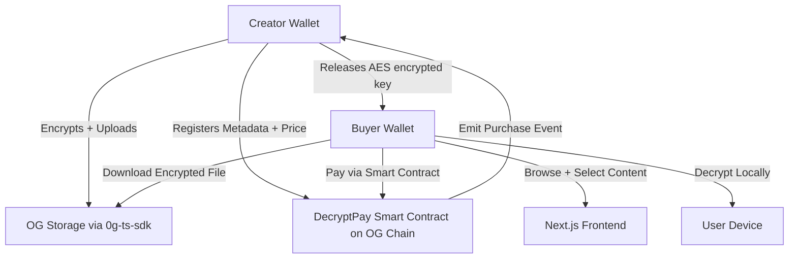

# 🔐 **DecryptPay — Decentralized Pay-Per-Download dApp on OG Chain**

## 🚀 **What It Does**

**DecryptPay** is a decentralized pay-per-download marketplace where creators can **encrypt and upload digital content** to **OG Storage**, and **sell access directly on-chain** through smart contracts deployed on **OG Chain**.

Every file uploaded is encrypted client-side, immutably stored via the **@0glabs/0g-ts-sdk**, and only decryptable by verified buyers — creating a **trustless, transparent, and censorship-resistant content economy**.

---

## 💡 **The Problem It Solves**

Creators today rely on centralized platforms like Patreon, Gumroad, or YouTube — which:

* Take up to **30% in fees**.
* Enforce **arbitrary moderation or takedowns**.
* Store user content on **centralized servers**.
* Provide no **verifiable proof of payment or delivery**.

DecryptPay replaces this with an **OG-native model**:

* Payments handled **directly by smart contracts on OG Chain**.
* Files permanently stored and retrievable via **OG Storage**.
* Access controlled through **on-chain key escrow** verified per buyer.

---

## ⚙️ **How It Works**

### 🔹 1. Creator Flow

1. The creator connects their wallet (via **RainbowKit + Wagmi**, configured for OG Chain).
2. Files are **encrypted locally using AES-GCM**.
3. Encrypted files are uploaded via **`@0glabs/0g-ts-sdk`** to OG Storage.
4. Metadata (title, price, file hash, storage link) is registered on-chain using a **custom marketplace contract**.

### 🔹 2. Buyer Flow

1. The buyer selects a file and initiates an **on-chain purchase transaction**.
2. The smart contract verifies payment and emits a purchase event.
3. The creator’s dashboard listens for this event and releases the decryption key to the buyer.
4. The buyer downloads the encrypted file from OG Storage and decrypts it locally.

All of this happens **without any centralized backend** — just OG Chain + OG Storage + a simple off-chain UI.

---

## 🧩 **Architecture Overview**

---

## 🛠️ **Technologies Used**

| Layer                   | Technology                                          |
| ----------------------- | --------------------------------------------------- |
| **Frontend**            | Next.js 15 + Tailwind CSS + Wagmi                   |
| **Blockchain**          | OG Chain (custom marketplace + escrow contract)     |
| **Storage**             | @0glabs/0g-ts-sdk (upload, retrieve, list, getFile) |
| **Wallets**             | RainbowKit + ethers.js                              |
| **Encryption**          | AES-GCM client-side (Web Crypto API)                |
| **Database (Optional)** | Supabase for public metadata caching                |

---

## 🧠 **Core Features**

### 🗂️ **Storage & Encryption**

* Files encrypted client-side before upload.
* Stored via `@0glabs/0g-ts-sdk` → returns an immutable `file_id` or `blob_cid`.
* Retrieval is direct via OG Storage endpoints.

### 💰 **Smart Contract Payments**

* Marketplace contract deployed on OG Chain.
* Handles:

  * `registerContent(fileId, price)` — creator registers content.
  * `purchase(fileId)` — buyer pays to access.
  * `verifyAccess(buyer, fileId)` — check if buyer has purchased.
* Events:

  * `PurchaseMade(buyer, fileId)`
  * `KeyReleased(buyer, fileId, encryptedKey)`

### 🎨 **Frontend UX**

* **Creator Dashboard** for uploads, file management, and sales tracking.
* **Marketplace Page** with thumbnails, prices, and instant on-chain buy buttons.
* **Buyer Dashboard** for viewing owned content and decrypting files.
* Clean **glassmorphic design** and toast notifications for transaction flow.

---

## 🌐 **Summary**

**DecryptPay** demonstrates how the **OG Chain + OG Storage** stack can power a real, censorship-resistant content economy —
a place where creators own their work, buyers own their access, and every transaction is provably fair and on-chain.

---
